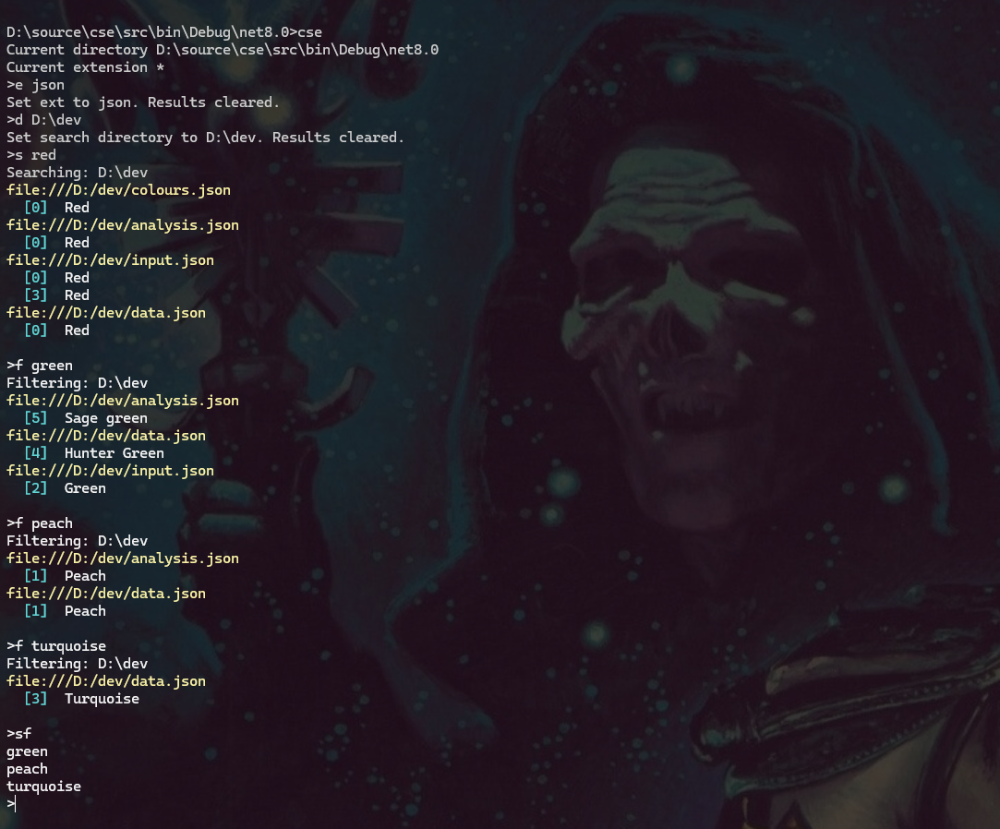

## Introduction

Content Search Extended is command line tool that recursively searches files for text. It is intended as an extremely simple grep-like tool and generates output as clickable links (assuming the user is using Windows Terminal).

## Download

Compiled downloads are not available.

## Compiling

To clone and run this application, you'll need [Git](https://git-scm.com) and [.NET](https://dotnet.microsoft.com/) installed on your computer. From your command line:

```
# Clone this repository
$ git clone https://github.com/btigi/ContentSearchExtended

# Go into the repository
$ cd src

# Build  the app
$ dotnet build
```

## Usage

```cse```

cse will indicate the current search directory (defauling to the current working directory) and the current file type extension (defauling to *), then await input. Supported inputs are:

`e` or `ext` e.g. `e txt` - set the file type extension to search

`d` or `dir` e.g. `d C:\dev` - set the directory to search (automatically includes all sub-directories)

`s` or `search` e.g. `s EmployeeDto` - run a case-insensitive search for the specified text

`f` or `filter` e.g. `f POST` - run a case-insensitive search for the specified text only in the files returned by the previous search

`sf` or `show` - show a list of the filters that have been used on the current search results

`r` or `reset` - clears the previous search results

`q` - exit the application

Note the `e`, `d`, `s` and `q` commands all implicitly clear the previous search results.




## Configuration

cse will read configuration values from cse.json if the file exists. The default file content is below
cse.json
```
{
  "FileForegroundColour": "Yellow",
  "FileBackgroundColour": "Black",
  "LineNumberForegroundColor": "Cyan",
  "LineForegroundColour": "White",
  "LineBackgroundColour": "Black",
  "DefaultForegroundColour": "White",
  "DefaultBackgroundColour": "Black"
  "ErrorBackgroundColour": "Black",
  "ErrorForegroundColour": "Red"
}
```

The configuration sets colouring options in the output. Colours are .NET colour types mapped to ConsoleColour types. Invalid colours are mapped as black.


## Licencing

Content Search Extended is licenced under CC BY-NC-ND 4.0 https://creativecommons.org/licenses/by-nc-nd/4.0/ Full licence details are available in licence.md